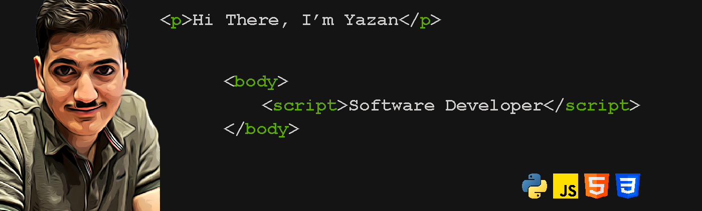

---

>_**So you can write a code to solve the Sudoko puzzle, yet you might not be able to solve it manually.**_ I'm Yazan Alfarra, a **Software Developer** with a background in  _Civil Engineering_ and this my **WHY** behind getting into software development.

|||
|---|---|
||I started my journey by teaching myself to code via Udemy and I'm curentlly enrolled in a professional bootcamp with LTUC powered by Code Fellows to enhance and develop as a Fullstack Software Developer using Python.|

 
 
 
 
  
